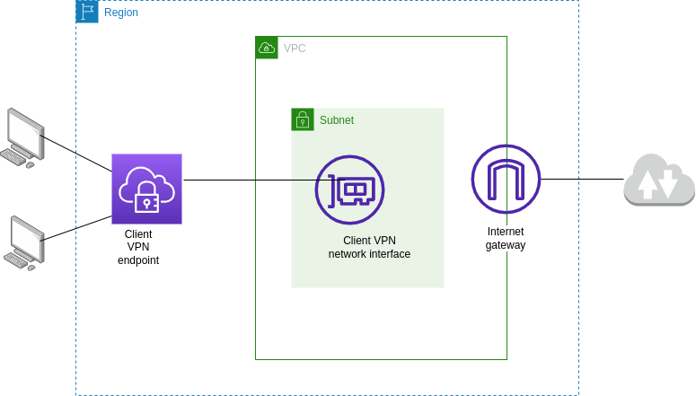
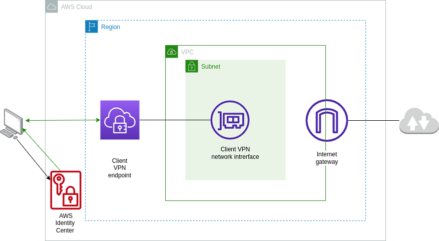

[](https://github.com/boldlink/terraform-aws-client-vpn/blob/main/LICENSE)
[](https://github.com/boldlink/terraform-aws-client-vpn/releases/latest)
[](https://github.com/boldlink/terraform-aws-client-vpn/actions)
[](https://github.com/boldlink/terraform-aws-client-vpn/actions)
[](https://github.com/boldlink/terraform-aws-client-vpn/actions)
[](https://github.com/boldlink/terraform-aws-client-vpn/actions)
[](https://github.com/boldlink/terraform-aws-client-vpn/actions)
[](https://github.com/boldlink/terraform-aws-client-vpn/actions)
[](https://github.com/boldlink/terraform-aws-client-vpn/actions)
[](https://github.com/boldlink/terraform-aws-client-vpn/actions)

[](https://boldlink.io)

# AWS client VPN Terraform module

## Description

AWS Client VPN is a managed client-based VPN service that enables you to securely access your AWS resources and resources in your on-premises network. With Client VPN, you can access your resources from any location using an OpenVPN-based VPN client.

This is a detailed terraform module that can be used to create AWS client VPN endpoint(s) and its associated resources.

## Why Choose This Module Over Standard Resources?

1. Simplified Resource Creation

This module streamlines the process of creating all the necessary resources for your AWS Client VPN with minimal configuration changes. You don't have to go through the complex setup steps manually; this module handles it for you.

2. Tested Examples for Quick Setup

We provide well-tested examples that you can use to set up your Client VPN quickly. These examples serve as templates, allowing you to configure your VPN within a very short time.

3. Support for Multiple Authentication Methods

Our module supports all modes of VPN authentication, including certificate authentication, federated authentication, and directory service authentication. You have the flexibility to choose the method that best suits your needs.

4. Security Best Practices

Security is a top priority. This module follows security best practices and uses Checkov to scan for vulnerabilities. You can rest assured that your VPN setup will adhere to industry standards.

5. Regular Maintenance and Updates

We are committed to maintaining the module's compatibility with the latest AWS provider versions. You can trust that our modules will remain secure and up to date.

6. Extensive Documentation

We provide detailed documentation to guide you through the setup process, making it easy to deploy and connect to your VPN endpoints. Whether you're using client certificates or federated authentication, we've got you covered.

By choosing this module, you save time and effort while ensuring a secure and reliable AWS Client VPN setup. Explore our examples and get started.


Examples available [`here`](./examples)

## Usage
*NOTE*: These examples use the latest version of this module

```console
module "miniumum" {
  source                 = "boldlink/client-vpn/aws"
  name                   = var.name
  client_cidr_block      = var.client_cidr_block
  vpc_id                 = local.vpc_id
  split_tunnel           = var.split_tunnel
  connection_log_options = var.connection_log_options
  authorization_rules = [{
    target_network_cidr  = local.vpc_cidr
    authorize_all_groups = true
    access_group_id      = null
    description          = "Authorize traffic to supporting VPC"
  }]
  ca_subject                = var.ca_subject
  server_subject            = var.server_subject
  create_client_certificate = var.create_client_certificate
  client_subject            = var.client_subject
  authentication_options    = var.authentication_options
  subnet_ids                = local.subnet_ids
  security_group_ingress    = var.security_group_ingress
  tags                      = var.tags
}
```

<h2>Points to note about AWS client VPN</h2>

- Client VPN CIDR and VPC CIDR MUST NOT overlap

- VPN endpoint and associated VPC must be in the same AWS account & region

- Associated subnets must be in the same VPC

- You cannot associate multiple subnets from the same AZ


<h2>How to deploy and connect to the module example's VPN endpoints:</h2>

## Connect using client certificate



1. Deploy the client-vpn examples using `make tests` command.

2. Download client keys from secrets manager using the commands below.
```console
aws secretsmanager get-secret-value --secret-id complete-example-client-vpn-client-certificate --query 'SecretString' --output text > complete-client.key
```
```console
aws secretsmanager get-secret-value --secret-id minimum-example-client-vpn-client-certificate --query 'SecretString' --output text > minimum-client.key
```

3. Download client certificates from acm using the commands below.
```console
aws acm get-certificate --certificate-arn <complete-client-certificate-arn> | jq -r '"\(.Certificate)\(.CertificateChain)"' > complete-client.crt
```
```console
aws acm get-certificate --certificate-arn <minimum-client-certificate-arn> | jq -r '"\(.Certificate)\(.CertificateChain)"' > minimum-client.crt
```

4. Download the Client VPN endpoint configuration files for each example VPN using the commands below.

```
aws ec2 export-client-vpn-client-configuration --client-vpn-endpoint-id <complete_example_client_vpn_endpoint_id> --output text > complete_example_config.ovpn
```
```
aws ec2 export-client-vpn-client-configuration --client-vpn-endpoint-id <minimum_example_client_vpn_endpoint_id> --output text > minimum_example_config.ovpn
```

5.Open the respective Client VPN endpoint configuration files downloaded above using your preferred text editor and add the following lines.
(macos and linux)

config file for complete example:
```console
--cert "/<path-where-complete-client.crt-was-downloaded>/complete-client.crt"
--key "/<path-where-complete-client.key-was-downloaded>/complete-client.key"
```
e.g
```console
--cert "/home/admin/Downloads/client-vpn/complete-client.crt"
--key "/home/admin/Downloads/client-vpn/complete-client.key"
```

config file for minimum example:
```console
--cert "/<path-where-minimum-client.crt-was-downloaded>/minimum-client.crt"
--key "/<path-where-minimum-client.key-was-downloaded>/minimum-client.key"
```

e.g
```console
--cert "/home/admin/Downloads/client-vpn/minimum-client.crt"
--key "/home/admin/Downloads/client-vpn/minimum-client.key"
```
6. Download aws VPN client application and create a profile for each vpn endpoint using their respective configuration files.

See here how to connect using AWS provided client VPN.

MacOs : https://docs.aws.amazon.com/vpn/latest/clientvpn-user/client-vpn-connect-macos.html

Linux : https://docs.aws.amazon.com/vpn/latest/clientvpn-user/client-vpn-connect-linux.html

Windows : https://docs.aws.amazon.com/vpn/latest/clientvpn-user/client-vpn-connect-windows.html

## Connect using federated authentication

### Prerequisites:

An AWS Account
AWS Organization that has IAM identity Center (SSO) enabled
Terraform Installed

1. Create a SAML 2.0 application

- In the AWS Console of your management account, navigate to the AWS IAM Identity Center Page. NOTE: You cannot administer IAM Identity Center from a member account.
- On the left-hand column of the page, navigate to “Applications”, then click the “Add a new application” button, then click “Add a custom SAML 2.0 application”.
- Give the SAML application a name, and a useful description.
- Click the link to download the “AWS SSO metadata file”. You will need this metadata file when you create the IAM identity provider.
- Enter `http://127.0.0.1:35001` as the Application ACS URL and `urn:amazon:webservices:clientvpn` as the Application SAML audience, and then click “Save changes”.
- Next, you need to set up attribute mappings. In this case you only need subject mapping which needs to have a string value of ${user:email} and should have the format emailAddress.

2. Create an IAM Identity provider

- From the management or member account in which the VPN client will be created, navigate to the IAM page in the AWS console, and click in the left navigation column for “Identity providers”.
- Click the option `Add provider`.
- Select `SAML` for the Provider type, and give the provider a name.
- Upload the metadata file you downloaded in step one above when creating the SAML Application
- Click `Add provider`
- Make note of the newly created provider ARN as you will need it when setting `saml_provider_arn` option under `authentication_options` in terraform.

3. Deploy client vpn endpoint using terraform
- Save the sample terraform code below in a `.tf` file.
- Replace <identity_provider_arn_created_in_step_2_above> with the actual ARN of your SAML provider created for federated authentication.
- Create a variables file (e.g., variables.tf) to define the input variables to be used. e.g `name` variable
- Initialize and apply terraform from the root folder containing the saved terraform file(s) using the commands below.

```
terraform init
terraform apply
```
- Terraform apply will prompt you to confirm the creation of resources. Review the plan and type `yes` to proceed.
- Take note of the client vpn id displayed as output. In the example below, the output has been declared as `cvpn_id`. The id will be used in step 4 below.

### Terraform example using federated-authentication
```
module "federated_authentication" {
  source            = "boldlink/client-vpn/aws"
  name              = var.name
  client_cidr_block = var.client_cidr_block
  vpc_id            = var.vpc_id
  split_tunnel      = var.split_tunnel
  authorization_rules = [{
    target_network_cidr  = var.vpc_cidr
    authorize_all_groups = true
    access_group_id      = null
    description          = "Authorize traffic to supporting VPC"
  }]
  ca_subject     = var.ca_subject
  server_subject = var.server_subject
  authentication_options = {
    type              = "federated-authentication"
    saml_provider_arn = "<identity_provider_arn_created_in_step_2_above>" # e.g. "arn:aws:iam::11111222223:saml-provider/AWS_SSO_FOR_CLIENT_VPN"
  }
  connection_log_options = var.connection_log_options
  subnet_ids             = var.subnet_ids
  create_kms_key         = var.create_kms_key
  security_group_ingress = var.security_group_ingress
  tags                   = var.tags
}

output "cvpn_id" {
  value = module.federated_authentication.id
}
```

4. Download the Client VPN endpoint configuration file using the command below.

```
aws ec2 export-client-vpn-client-configuration --client-vpn-endpoint-id <client_vpn_endpoint_id> --output text > config.ovpn
```

5. Download aws VPN client application and create a profile for each vpn endpoint using their respective configuration files.

See here how to connect using AWS provided client VPN.

MacOs : https://docs.aws.amazon.com/vpn/latest/clientvpn-user/client-vpn-connect-macos.html

Linux : https://docs.aws.amazon.com/vpn/latest/clientvpn-user/client-vpn-connect-linux.html

Windows : https://docs.aws.amazon.com/vpn/latest/clientvpn-user/client-vpn-connect-windows.html

## Documentation

[AWS Documentation](https://docs.aws.amazon.com/vpn/latest/clientvpn-admin/what-is.html)

[Terraform documentation](https://registry.terraform.io/providers/hashicorp/aws/latest/docs/resources/ec2_client_vpn_endpoint)

<!-- BEGINNING OF PRE-COMMIT-TERRAFORM DOCS HOOK -->
## Requirements

| Name | Version |
|------|---------|
| <a name="requirement_terraform"></a> [terraform](#requirement\_terraform) | >= 0.14.11 |
| <a name="requirement_aws"></a> [aws](#requirement\_aws) | >= 5.9.0 |
| <a name="requirement_tls"></a> [tls](#requirement\_tls) | >= 3.2.0 |

## Providers

| Name | Version |
|------|---------|
| <a name="provider_aws"></a> [aws](#provider\_aws) | 5.17.0 |
| <a name="provider_tls"></a> [tls](#provider\_tls) | 4.0.4 |

## Modules

No modules.

## Resources

| Name | Type |
|------|------|
| [aws_acm_certificate.client](https://registry.terraform.io/providers/hashicorp/aws/latest/docs/resources/acm_certificate) | resource |
| [aws_acm_certificate.server](https://registry.terraform.io/providers/hashicorp/aws/latest/docs/resources/acm_certificate) | resource |
| [aws_cloudwatch_log_group.main](https://registry.terraform.io/providers/hashicorp/aws/latest/docs/resources/cloudwatch_log_group) | resource |
| [aws_ec2_client_vpn_authorization_rule.main](https://registry.terraform.io/providers/hashicorp/aws/latest/docs/resources/ec2_client_vpn_authorization_rule) | resource |
| [aws_ec2_client_vpn_endpoint.main](https://registry.terraform.io/providers/hashicorp/aws/latest/docs/resources/ec2_client_vpn_endpoint) | resource |
| [aws_ec2_client_vpn_network_association.main](https://registry.terraform.io/providers/hashicorp/aws/latest/docs/resources/ec2_client_vpn_network_association) | resource |
| [aws_ec2_client_vpn_route.main](https://registry.terraform.io/providers/hashicorp/aws/latest/docs/resources/ec2_client_vpn_route) | resource |
| [aws_kms_alias.main](https://registry.terraform.io/providers/hashicorp/aws/latest/docs/resources/kms_alias) | resource |
| [aws_kms_key.main](https://registry.terraform.io/providers/hashicorp/aws/latest/docs/resources/kms_key) | resource |
| [aws_secretsmanager_secret.ca](https://registry.terraform.io/providers/hashicorp/aws/latest/docs/resources/secretsmanager_secret) | resource |
| [aws_secretsmanager_secret.client](https://registry.terraform.io/providers/hashicorp/aws/latest/docs/resources/secretsmanager_secret) | resource |
| [aws_secretsmanager_secret.server](https://registry.terraform.io/providers/hashicorp/aws/latest/docs/resources/secretsmanager_secret) | resource |
| [aws_secretsmanager_secret_version.ca](https://registry.terraform.io/providers/hashicorp/aws/latest/docs/resources/secretsmanager_secret_version) | resource |
| [aws_secretsmanager_secret_version.client](https://registry.terraform.io/providers/hashicorp/aws/latest/docs/resources/secretsmanager_secret_version) | resource |
| [aws_secretsmanager_secret_version.server](https://registry.terraform.io/providers/hashicorp/aws/latest/docs/resources/secretsmanager_secret_version) | resource |
| [aws_security_group.main](https://registry.terraform.io/providers/hashicorp/aws/latest/docs/resources/security_group) | resource |
| [tls_cert_request.client](https://registry.terraform.io/providers/hashicorp/tls/latest/docs/resources/cert_request) | resource |
| [tls_cert_request.server](https://registry.terraform.io/providers/hashicorp/tls/latest/docs/resources/cert_request) | resource |
| [tls_locally_signed_cert.client](https://registry.terraform.io/providers/hashicorp/tls/latest/docs/resources/locally_signed_cert) | resource |
| [tls_locally_signed_cert.server](https://registry.terraform.io/providers/hashicorp/tls/latest/docs/resources/locally_signed_cert) | resource |
| [tls_private_key.ca](https://registry.terraform.io/providers/hashicorp/tls/latest/docs/resources/private_key) | resource |
| [tls_private_key.client](https://registry.terraform.io/providers/hashicorp/tls/latest/docs/resources/private_key) | resource |
| [tls_private_key.server](https://registry.terraform.io/providers/hashicorp/tls/latest/docs/resources/private_key) | resource |
| [tls_self_signed_cert.ca](https://registry.terraform.io/providers/hashicorp/tls/latest/docs/resources/self_signed_cert) | resource |
| [aws_caller_identity.current](https://registry.terraform.io/providers/hashicorp/aws/latest/docs/data-sources/caller_identity) | data source |
| [aws_partition.current](https://registry.terraform.io/providers/hashicorp/aws/latest/docs/data-sources/partition) | data source |
| [aws_region.current](https://registry.terraform.io/providers/hashicorp/aws/latest/docs/data-sources/region) | data source |

## Inputs

| Name | Description | Type | Default | Required |
|------|-------------|------|---------|:--------:|
| <a name="input_authentication_options"></a> [authentication\_options](#input\_authentication\_options) | (Required) Information about the authentication method to be used to authenticate clients. | `map(string)` | n/a | yes |
| <a name="input_authorization_rules"></a> [authorization\_rules](#input\_authorization\_rules) | Provides authorization rules for AWS Client VPN endpoints. | <pre>list(object({<br>    target_network_cidr  = string<br>    access_group_id      = string<br>    authorize_all_groups = bool<br>    description          = string<br>  }))</pre> | `[]` | no |
| <a name="input_ca_subject"></a> [ca\_subject](#input\_ca\_subject) | The subject for which ca certificate is being requested. The acceptable arguments are all optional | `any` | `{}` | no |
| <a name="input_client_cidr_block"></a> [client\_cidr\_block](#input\_client\_cidr\_block) | (Required) The IPv4 address range, in CIDR notation, from which to assign client IP addresses. The address range cannot overlap with the local CIDR of the VPC in which the associated subnet is located, or the routes that you add manually. The address range cannot be changed after the Client VPN endpoint has been created. The CIDR block should be /22 or greater. | `string` | n/a | yes |
| <a name="input_client_connect_options"></a> [client\_connect\_options](#input\_client\_connect\_options) | (Optional) The options for managing connection authorization for new client connections. | `map(string)` | `{}` | no |
| <a name="input_client_login_banner_options"></a> [client\_login\_banner\_options](#input\_client\_login\_banner\_options) | (Optional) Options for enabling a customizable text banner that will be displayed on AWS provided clients when a VPN session is established. | `map(string)` | `{}` | no |
| <a name="input_client_subject"></a> [client\_subject](#input\_client\_subject) | The subject for which client certificate is being requested. The acceptable arguments are all optional | `any` | `{}` | no |
| <a name="input_cloudwatch_log_group_prefix"></a> [cloudwatch\_log\_group\_prefix](#input\_cloudwatch\_log\_group\_prefix) | Creates a unique name beginning with the specified prefix. | `string` | `"/aws/vpn-client"` | no |
| <a name="input_connection_log_options"></a> [connection\_log\_options](#input\_connection\_log\_options) | (Required) Information about the client connection logging options. | `map(string)` | n/a | yes |
| <a name="input_create_client_certificate"></a> [create\_client\_certificate](#input\_create\_client\_certificate) | Whether to create client certificate | `bool` | `false` | no |
| <a name="input_create_kms_key"></a> [create\_kms\_key](#input\_create\_kms\_key) | Choose whether to create kms key for logs encryption | `bool` | `false` | no |
| <a name="input_create_server_certificate"></a> [create\_server\_certificate](#input\_create\_server\_certificate) | Whether to create server certificate | `bool` | `true` | no |
| <a name="input_deletion_window_in_days"></a> [deletion\_window\_in\_days](#input\_deletion\_window\_in\_days) | (Optional) The waiting period, specified in number of days. After the waiting period ends, AWS KMS deletes the KMS key. If you specify a value, it must be between 7 and 30, inclusive. If you do not specify a value, it defaults to 30. If the KMS key is a multi-Region primary key with replicas, the waiting period begins when the last of its replica keys is deleted. Otherwise, the waiting period begins immediately. | `number` | `30` | no |
| <a name="input_description"></a> [description](#input\_description) | (Optional) A brief description of the Client VPN endpoint. | `string` | `"aws client vpn"` | no |
| <a name="input_dns_servers"></a> [dns\_servers](#input\_dns\_servers) | (Optional) Information about the DNS servers to be used for DNS resolution. A Client VPN endpoint can have up to two DNS servers. If no DNS server is specified, the DNS address of the connecting device is used. | `list(string)` | `[]` | no |
| <a name="input_enable_key_rotation"></a> [enable\_key\_rotation](#input\_enable\_key\_rotation) | (Optional) Specifies whether key rotation is enabled. Defaults to false. | `bool` | `true` | no |
| <a name="input_kms_key_id"></a> [kms\_key\_id](#input\_kms\_key\_id) | Amazon Resource Name (ARN) of the KMS Key to use when encrypting | `string` | `null` | no |
| <a name="input_name"></a> [name](#input\_name) | Name must be 255 characters or less in length. | `string` | n/a | yes |
| <a name="input_recovery_window_in_days"></a> [recovery\_window\_in\_days](#input\_recovery\_window\_in\_days) | (Optional) Number of days that AWS Secrets Manager waits before it can delete the secret. This value can be 0 to force deletion without recovery or range from 7 to 30 days. The default value is 30. | `number` | `30` | no |
| <a name="input_retention_in_days"></a> [retention\_in\_days](#input\_retention\_in\_days) | Specifies the number of days you want to retain log events in the specified log group. Possible values are: 1, 3, 5, 7, 14, 30, 60, 90, 120, 150, 180, 365, 400, 545, 731, 1827, 3653, and 0. If you select 0, the events in the log group are always retained and never expire. | `number` | `1827` | no |
| <a name="input_rsa_bits"></a> [rsa\_bits](#input\_rsa\_bits) | the size of the generated RSA key, in bits (default: 2048). | `number` | `2048` | no |
| <a name="input_security_group_ids"></a> [security\_group\_ids](#input\_security\_group\_ids) | (Optional) The IDs of one or more security groups to apply to the target network. You must also specify the ID of the VPC that contains the security groups. | `list(string)` | `[]` | no |
| <a name="input_security_group_ingress"></a> [security\_group\_ingress](#input\_security\_group\_ingress) | Specify the ingress rule for the security group | `any` | `{}` | no |
| <a name="input_self_service_portal"></a> [self\_service\_portal](#input\_self\_service\_portal) | (Optional) Specify whether to enable the self-service portal for the Client VPN endpoint. Values can be enabled or disabled. Default value is disabled. | `string` | `"disabled"` | no |
| <a name="input_server_certificate_arn"></a> [server\_certificate\_arn](#input\_server\_certificate\_arn) | (Required) The ARN of the ACM server certificate. | `string` | `""` | no |
| <a name="input_server_subject"></a> [server\_subject](#input\_server\_subject) | The subject for which server certificate is being requested. The acceptable arguments are all optional | `any` | `{}` | no |
| <a name="input_session_timeout_hours"></a> [session\_timeout\_hours](#input\_session\_timeout\_hours) | (Optional) The maximum session duration is a trigger by which end-users are required to re-authenticate prior to establishing a VPN session. Default value is 24 - Valid values: 8 \| 10 \| 12 \| 24 | `number` | `24` | no |
| <a name="input_split_tunnel"></a> [split\_tunnel](#input\_split\_tunnel) | (Optional) Indicates whether split-tunnel is enabled on VPN endpoint. Default value is false. | `bool` | `false` | no |
| <a name="input_subnet_ids"></a> [subnet\_ids](#input\_subnet\_ids) | (Required) The IDs of the subnets to associate with the Client VPN endpoint. | `list(string)` | n/a | yes |
| <a name="input_tags"></a> [tags](#input\_tags) | (Optional) A mapping of tags to assign to the resource. If configured with a provider default\_tags configuration block present, tags with matching keys will overwrite those defined at the provider-level. | `map(string)` | `{}` | no |
| <a name="input_transport_protocol"></a> [transport\_protocol](#input\_transport\_protocol) | (Optional) The transport protocol to be used by the VPN session. Default value is udp. | `string` | `"udp"` | no |
| <a name="input_validity_period_hours"></a> [validity\_period\_hours](#input\_validity\_period\_hours) | (Number) Number of hours, after initial issuing, that the certificate will remain valid for. | `number` | `17520` | no |
| <a name="input_vpc_id"></a> [vpc\_id](#input\_vpc\_id) | (Optional) The ID of the VPC to associate with the Client VPN endpoint. If no security group IDs are specified in the request, the default security group for the VPC is applied. | `string` | `null` | no |
| <a name="input_vpn_port"></a> [vpn\_port](#input\_vpn\_port) | (Optional) The port number for the Client VPN endpoint. Valid values are 443 and 1194. Default value is 443. | `number` | `443` | no |
| <a name="input_vpn_routes"></a> [vpn\_routes](#input\_vpn\_routes) | Provides additional routes for AWS Client VPN endpoints. | <pre>list(object({<br>    target_vpc_subnet_id   = string<br>    destination_cidr_block = string<br>    description            = string<br>  }))</pre> | `[]` | no |

## Outputs

| Name | Description |
|------|-------------|
| <a name="output_arn"></a> [arn](#output\_arn) | The ARN of the Client VPN endpoint. |
| <a name="output_dns_name"></a> [dns\_name](#output\_dns\_name) | The DNS name to be used by clients when establishing their VPN session. |
| <a name="output_id"></a> [id](#output\_id) | The ID of the Client VPN endpoint. |
| <a name="output_owner_id"></a> [owner\_id](#output\_owner\_id) | Owner ID |
| <a name="output_sg_arn"></a> [sg\_arn](#output\_sg\_arn) | ARN of the security group. |
| <a name="output_sg_id"></a> [sg\_id](#output\_sg\_id) | ID of the security group. |
| <a name="output_tags_all"></a> [tags\_all](#output\_tags\_all) | A map of tags assigned to the resource, including those inherited from the provider. |
<!-- END OF PRE-COMMIT-TERRAFORM DOCS HOOK -->

## Third party software
This repository uses third party software:
* [pre-commit](https://pre-commit.com/) - Used to help ensure code and documentation consistency
  * Install with `brew install pre-commit`
  * Manually use with `pre-commit run`
* [terraform 0.14.11](https://releases.hashicorp.com/terraform/0.14.11/) For backwards compatibility we are using version 0.14.11 for testing making this the min version tested and without issues with terraform-docs.
* [terraform-docs](https://github.com/segmentio/terraform-docs) - Used to generate the [Inputs](#Inputs) and [Outputs](#Outputs) sections
  * Install with `brew install terraform-docs`
  * Manually use via pre-commit
* [tflint](https://github.com/terraform-linters/tflint) - Used to lint the Terraform code
  * Install with `brew install tflint`
  * Manually use via pre-commit

### Supporting resources:

The example stacks are used by BOLDLink developers to validate the modules by building an actual stack on AWS.

Some of the modules have dependencies on other modules (ex. Ec2 instance depends on the VPC module) so we create them
first and use data sources on the examples to use the stacks.

Any supporting resources will be available on the `tests/supportingResources` and the lifecycle is managed by the `Makefile` targets.

Resources on the `tests/supportingResources` folder are not intended for demo or actual implementation purposes, and can be used for reference.

### Makefile
The makefile contain in this repo is optimized for linux paths and the main purpose is to execute testing for now.
* Create all tests stacks including any supporting resources:
```console
make tests
```
* Clean all tests *except* existing supporting resources:
```console
make clean
```
* Clean supporting resources - this is done separately so you can test your module build/modify/destroy independently.
```console
make cleansupporting
```
* !!!DANGER!!! Clean the state files from examples and test/supportingResources - use with CAUTION!!!
```console
make cleanstatefiles
```


#### BOLDLink-SIG 2023
